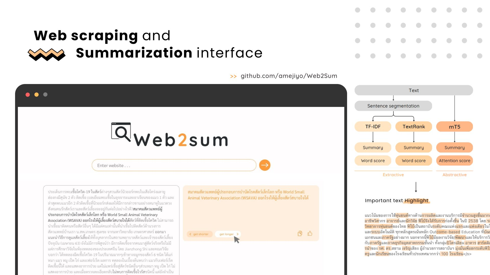

# Web2Sum
 A mockup web application of Thai web scraper to text summarize with word length selection, and important text visualization.



## Appendix
📁[Google Drive](https://drive.google.com/drive/folders/1eycRcO2_xs6bJd0_1lCI4ZjrOXV2N7mn?usp=sharing) | 
📄[Report Docs](https://docs.google.com/document/d/1KUCkL23nc9xgmZlUj43Libs7y7ZtmHPQwx8gPfH73Rc/edit?usp=sharing) | 
💻[Presentation](https://www.canva.com/design/DAFh8M8fXhA/JeDjh2_DTnQxwcFyZrYz0g/edit?utm_content=DAFh8M8fXhA&utm_campaign=designshare&utm_medium=link2&utm_source=sharebutton)


## Pretrained

| Model  | Detail  | Paper  | Download  |
| :------ | :------ | :------ | :------------ |
| [mT5-multilingual-XLSum](https://huggingface.co/csebuetnlp/mT5_multilingual_XLSum#mt5-multilingual-xlsum) | Multilingual T5 (mT5): a massively multilingual pretrained text-to-text transformer model finetuned on the 45 languages of XL-Sum dataset. | [XL-Sum: Large-Scale Multilingual Abstractive Summarization for 44 Languages](https://aclanthology.org/2021.findings-acl.413/) | [Github](https://github.com/csebuetnlp/xl-sum) |


## Setup Library and install all dependencies
```python
>>>python -m pip install -r mT5thai/requirements.txt
```

## Running web application interface (on command line)
### Terminal 1 (in webapp dir)
```
>>> npm start
```

### Terminal 2 (in mT5thai dir)
```
>>> python python-server.py
```

